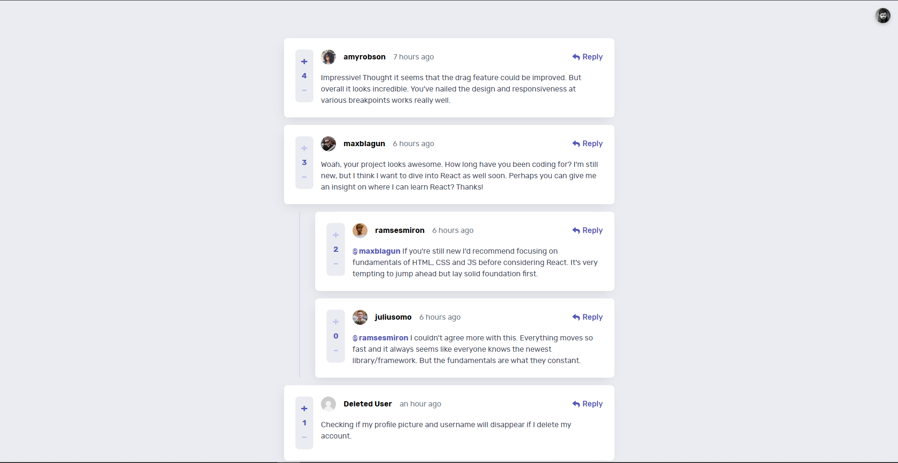

# Frontend Mentor - Interactive comments section solution

This is a solution to the [Interactive comments section challenge on Frontend Mentor](https://www.frontendmentor.io/challenges/interactive-comments-section-iG1RugEG9). Frontend Mentor challenges help you improve your coding skills by building realistic projects.

## Table of contents

- [Overview](#overview)
  - [The challenge](#the-challenge)
  - [Screenshot](#screenshot)
  - [Links](#links)
- [My process](#my-process)
  - [Built with](#built-with)
- [Author](#author)

## Overview

### The challenge

Users should be able to:

- View the optimal layout for the app depending on their device's screen size
- See hover states for all interactive elements on the page
- Create, Read, Update, and Delete comments and replies
- Upvote and downvote comments
- **Bonus** ❌: If you're building a purely front-end project, use `localStorage` to save the current state in the browser that persists when the browser is refreshed.
- **Bonus** ✅: Instead of using the `createdAt` strings from the `data.json` file, try using timestamps and dynamically track the time since the comment or reply was posted.

### What I've added

- Users can create new accounts and log in to their existing accounts using a valid email address (the email address format must be valid but doesn't need to exist). Once logged in, their session will remain active for 2 days, meaning they won't need to log back in during that period.
- Within the user's menu, there are convenient functionalities such as logout, delete account, and edit account.
- It's important to note that all data is securely stored on [mockapi.io](https://mockapi.io)

### Screenshot

### Links

- [Solution](https://www.frontendmentor.io/solutions/interactive-comments-section-react-scss-qEiMZGQJMB)
- [Live site](https://bt-comment-section.netlify.app/)

## My process

### Built with

- Semantic HTML5 markup
- CSS custom properties
- Flexbox
- CSS Grid
- Mobile-first workflow
- [React](https://reactjs.org/) - JS library
- [SCSS](https://sass-lang.com/)
- [Vite](https://vitejs.dev)

## Author

- [Frontend Mentor](https://www.frontendmentor.io/profile/boristenkes)
- [Github](https://www.github.com/boristenkes/)
